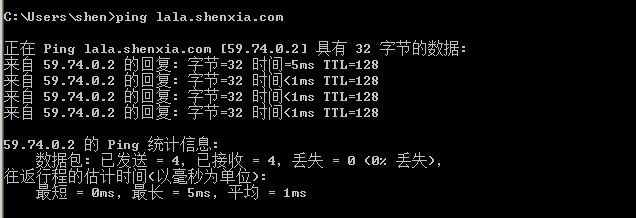
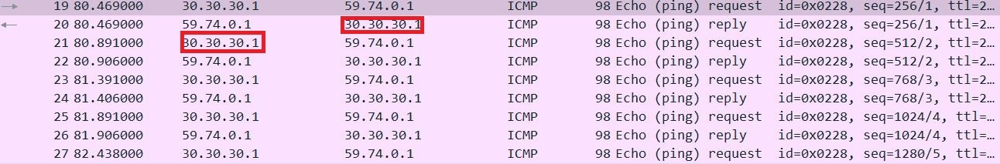

## 校园网络规划

该工程在ensp模拟器上实现

#### 简介

该工程在运行环境为ensp模拟器和VM虚拟机上，ensp主要是网络的拓扑结构，VM虚拟机有web，dns服务器。项目主要是校园网络的搭建。从校内网络的建设到教育网和运营商网络的连接。校内网络通过交换机进行连接，通过VLAN技术进行通信。路由器之间通过OSPF协议进行路由。校内网与外网通过NAT进行地址转换。服务器方面，通过云对虚拟机进行桥接，连接上DNS服务器和Web服务器。

#### 地址划分

| 区域        | 互联IP           | 互联vlan | 区域    |
| --------- | -------------- | ------ | ----- |
| 出口        | 192.168.4.0/27 | 14     | 出口    |
| R3—R1     | 30.30.30.0/27  |        | R3-R1 |
| 中教（中国教育网） | 59.74.0.0/15   |        | 中教    |
| R4-R3     | 10.10.10.0/24  |        | R4-R3 |
| 中联（中国联通）  | 20.20.20.0/24  |        | 中联    |
| 教学楼       | 192.168.1.0/27 | 11     | 教学楼   |
| 实验楼       | 192.168.2.0/27 | 12     | 实验楼   |
| 宿舍楼       | 192.168.3.0/27 | 13     | 宿舍楼   |

#### 测试结果

1. DNS测试

2. WEB测试

3. NAT测试

